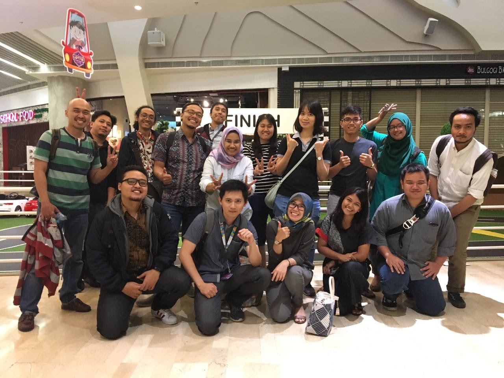

# Hello world!

I'm Son Nguyen. A software engineer in Ho Chi Minh city.

I am enthusiastic about new technologies and enjoy working in a fast-paced yet professional environment where I get to work with both like-minded people as well as other types who I can learn from.

Don't try to be a developer - Try to be a good staff! Working like your own company, working by your heart. Company will be in charge everything for you.

> Technical stack

Backend:

- NodeJS, Typescript, Javascript, Python, Go
- Message Queue: Kafka, RabbitMQ, AWS SQS
- Database: SQL(MySQL, SQL, Postgress) NoSQL(MongoDB, DynamoDB)
- CI/CD with GitLab-CI, Jenkins... full Agile methodology
- Logging, Monitoring with Spunk, Dynatrace, App Dynamic
- Scale-up with micro-service handle a million users, request tracing, monitoring

Front-End:

- ReactJS, AngularJS, React native
- Tailwindcss, Bootstrap.
- NextJS for server-side rendering application.

Domains:

- Fintech, Banking(Transformation from traditional to digital product), Digital banking: from 2017 - Now
- Ecommerce: B2C Ecommerce
- Social Network to sell the insurance product

> Next step

- Become a strong Senior Software Engineer
- Learn new technology grow up to Solution Architect, backend focused

> Contact Me

- Skype: nvs2394
- Linkedin: https://www.linkedin.com/in/nvs2394

I'm open to learning something new from over SEA, Finland

