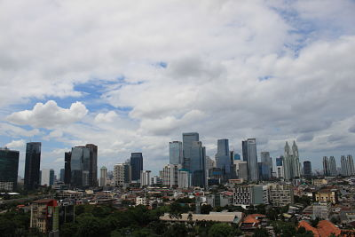

#### Hành trình đi onsite Indonesia của developer Việt. From Vietnam to Jakatar, Indonesia :airplane: (Kỳ I)

Dạo gần đây có nhiều bạn muốn đi làm onsite ở mấy nước như Malaysia hay Indonesia mà trước đó họ chưa bao giờ đặt chân tới inbox hỏi mình kinh nghiệm lúc trước mình làm như thế nào. Thế là lòi ra bài viết này :point_down:

Bài này mình muốn chia sẻ về hành trình một năm sống và làm việc ở Sứ Vạn Đảo. Nơi mà mọi người đều biết đến với sóng thần, động đất và những trận bóng nảy lửa giữa :vietnam: - :indonesia: ở ao làng SEA Game nữa.

> :satisfied: Chán nản nghỉ viêc và tìm Job mới - Nguời ta còn gọi là thử thách mới

Sau khi làm xong khoá luận tốt nghiệp vào 1-2017 mình bắt đầu tìm kiếm một thử thách mới. Trước đó mình đã nghỉ công ty cũ sau một năm làm việc(10/2016) và có vài tháng rong ruổi fix bug cho các công ty để kiếm tiền ăn qua ngày.

Đang lúc hết tiền tranh thủ về quê làm hộ chiếu để đi thi TOEIC lấy bằng tốt nghiệp thì mình được chị kia gọi hỏi là `'có job ở Indo đi onsite, Nodejs em có muốn đi không'`. Sau vài ngày thương thảo thì mình xách balo lên và đi trong khi trong não chưa có một định hình gì về công việc sẽ làm và cuộc sống ở Jakatar.

> :boom: Selamat datang - những tháng đầu bắt đầu cuộc sống mới ở Indo. :wave:

Vì mình đi theo dạng onsite của công ty nên HR trong công ty đã book sẵn khách sạn và làm hết mọi thủ tục. Bọn mình chỉ việc tới check in và ở rồi xách mông về :)

Cuộc sống ở Indo khá mới mẻ, công việc suốt ngày chỉ có `đi làm <-> ăn <-> ngủ` nên mọi việc cũng rất chú tâm và từ đó skills cũng tăng lên theo để thích ứng với môi trường.
Mình phải làm trái công nghệ khi tham gia vào dự án nhưng đó cũng là cơ hội với mình để học thêm những cái mới vừa học vừa thực hành (!lại không mất tiền học phí!!!! nghe rất hư trúc nhưng lại mộ dung phục), có bữa đi làm về rồi phải làm tiếp và làm tới 2-3 h sáng có bữa thì 3-4h thì mới có thể bắt kịp các anh và các bạn trên công ty(thật ra là mình sợ bị đuổi về >.< ). Đó là khoảng thời gian mình học một thứ nhanh nhất từ không biết thành biết và làm được. Học từ những người xung quanh, mọi người chỉ mình rất nhiệt tình từ a hơn mình nhiều tuổi cho tới a ở chung phòng làm dùm :))

Khi bạn làm chuyện gì lúc mới bắt đầu cũng đều rất khó khăn, mình cũng vậy. Lúc đầu mới qua team có cả người Indo, Ấn, Iraq, Brazil và còn rất nhiều người từ những team khác đến từ khắp nơi trên thế giới. Khả năng giao tiếp tiếng Anh với những bạn đến từ nước nói nhanh(như tàu chạy) của mình không được tốt, lúc đầu hầu như mình không nghe được họ nói gì chỉ nghe được vài từ khoá rồi đoán :). May thay chuyện cũng dần quen những tháng ngày sau đó mình đã quen với cách nói chuyện của họ và cho tới bây giờ mình lại bị tật nói quá nhanh.

Cuộc sống và công việc dần trở nên tốt hơn ở những ngày sau đó. Mọi người làm việc rất vui vẻ, cả team meeting lúc nào cũng đòi đi ăn team dinner.

> Chán Indo - Đòi về....

Viết dài quá nên mình sẽ viết tiếp ở Kì II.

Hotel nơi mình ở

![Hotel] (./IMG_0531.JPG)
(Cảnh đường phố ở Indo)
