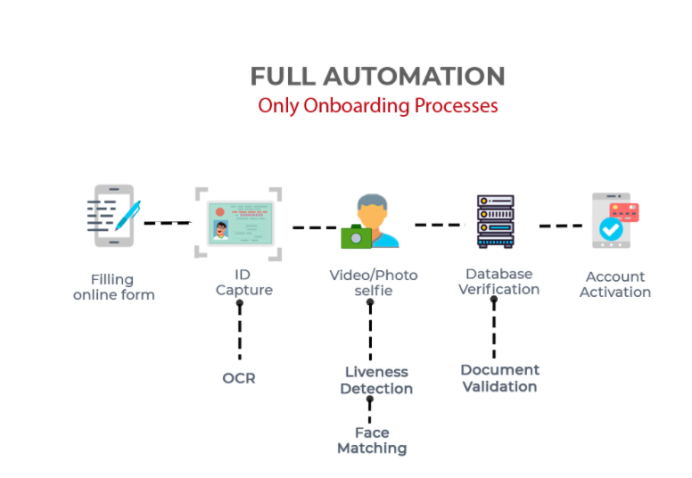
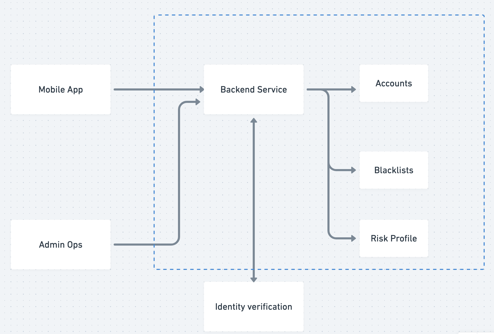

#### Thiết kế hệ thống eKYC

Dạo gần đây có rất nhiều ứng dụng fintech hoặc ngân hàng số quảng cáo về hệ thống định danh điện tử của ngân hàng của họ như Techcombank, MB bank ...

Lợi ích của eKYC

- Tự động hoá quy trình onboarding
- Giảm thiểu giấy tờ
- Khắc phục lừa đảo
- Nâng cao trải nghiệm của người dùng

Công nghệ

- OCR
- Face matching
- Liveness Detection
- Fraud Detection

.....

> TCBS: https://www.tcbs.com.vn/vi_VN/ho-tro/chi-tiet?url=mo-tai-khoan-chung-khoan-truc-tuyen--ekyc-
> MB Bank: https://thebank.vn/blog/19961-mbbank-trien-khai-tinh-nang-mo-tai-khoan-online-voi-ekyc.html

Vậy câu hỏi đặt ra là làm sao có thể thiết kế một hệ thống eKYC đơn giản nhất. Một hệ thống có thể đáp ứng được nhu cầu của khách hàng và giảm thiểu rủi ro cho những người quản lý.

Mình sẽ bóc tách từng chi tiết của một hệ thống đơn giản nhất. Về hệ thống eKYC này mình thấy nó khá là giống nhau giữa 2 app fintech mình đã làm ở Indonesia (2019) và Malaysia (2021)

- Khách hàng cung cấp chứng mình nhân dân/ thẻ căn cước / hộ chiếu.

- Nhâp số chứng mình nhân dân và chụp hình mặt trước, mặt sau của CMND/ CCCD đó.

- Xác thực khuôn mặt tự động bằng cách chụp hình chân dung.

- Hệ thống sẽ nhận được thông tin về yêu cầu eKYC và process trong khoảng vài phút sau đó sẽ báo kết quả cho khách hàng.

- Khách hàng có thể nhận được thông báo thành công khi chứng từ cung cấp hợp lệ. Và thông báo thất bại khi chứng từ không hợp lệ hoặc thông tin của bạn nằm trong diện cấm giao dịch của các cơ quan nhà nước, ...

Để xây dựng được một hệ thống hoàn chỉnh thì chúng ta có thể.

- Sử dụng những giải pháp có sẵn và tích hợp vào hệ thống của mình. (https://www.jumio.com, https://sumsub.com/)

- Tự xây dựng một hệ thống từ đầu tới cuối, từ cơ chế nhận diện và xác thực sau đó tích hợp vào hệ thống của ứng dựng hiện có https://www.vng.com.vn/news/news/vng-cung-cap-giai-phap-xac-thuc-khach-hang-dien-tu-trueid-cho-vietcapital-bank.html

#### Kiến trúc tổng thể

Chúng ta có thể chia hệ thống thành các phần đơn giản như sau

- Hệ thống cho người dùng nhập và upload thông tin. Có thể là web app hoặc mobile application.

- Backend processing (hệ thống xử lý phía sau). Hệ thống này có thể bao gồm các cụm service được kết nối lẫn nhau để truy cập tài nguyên phục vụ cho việc kiểm tra, xác thực, đánh giá độ rủi ro. Phần backend sẽ connect tới Identity verification system ở ngoài.

- Phần Admin Operation giúp cho Risk Ops có thể quản lý và hỗ trợ người dùng. Có thể manual update trạng thái eKYC và tạo risk profile khi cần.

Chúng ta sẽ đi phân tích sâu vào từng chức năng và nhiệm vụ của từng service, component bên trong.
