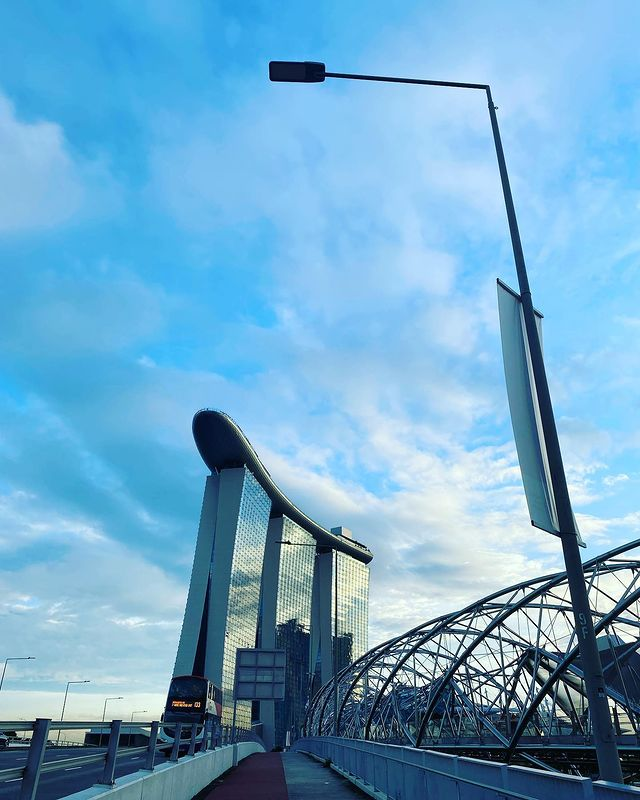

### Lý do chuyển việc

Mình mong muốn tới Singapore làm việc sau khi tốt nghiệp ĐH CNTT ở VN từ năm 2016 nhưng lúc này trình độ và góc nhìn chưa được rộng nên chưa thể biến mong muốn thành sự thật. Sau khi làm cho 3 công ty cả ở VN và Indonesia, Malaysia trong khoảng 6 năm thì mình quyết định muốn có 1 công việc ở nước ngoài và mình chọn Singapore.

- Singapore là điểm nóng về đổi mới công nghệ trong lĩnh vực ngân hàng

- Nhiều cơ hội việc làm ở Singapore cho vị trí Software Engineer

- Nền kinh tế phát triển, năng động

- Là một quốc gia dùng tiếng anh là ngôn ngữ chính (mặc dù có cả tiếng Hoa nữa)

- Một yếu tố quan trọng hơn là rất gần Việt Nam (hành trình bay mất khoảng 1h45p) mình có thể quay về nhà ở VN vào thứ 6 và trở lại Singapore vào tối chủ nhật.

...và còn nhiều yếu tố khác nữa...

Và cuối cùng mình đã có mặt tại đất nước Singapore vào đầu tháng 12/2021

### Hành trình tìm việc

Để chuẩn bị cho hành trình tìm tiệc ở Singapore mình đã chuẩn bị khoảng 6 tháng trước đó. Mình hay theo dõi những công ty ở Singapore(Startup và Consulting) trên linkedin. Hầu như mình lướt Linkedin nhiều hơn những mạng xã hội khác. :)

Sau khi xác định những công ty mà mình muốn apply thì mình khoanh vùng những công ty đó và thêm vào danh sách sẽ nộp đơn.

Khi có được danh sách những công ty có ý định nộp đơn và muốn vào làm thì mình sẽ bắt đầu quá trình rải CV. Thời điểm tháng 6-7/2021 là đỉnh của dịch nên hầu hết những công ty mà mình nộp đơn đều ko trả lời lại hoặc trả lời với email từ chối vì tình hình dịch bệnh nên công ty không tuyển người nước ngoài.

Và rồi mình dược 3 cty phỏng vấn sau đó có 1 offer. Sau 2 tháng chuyển giao công việc cũ và làm hồ sơ giấy tờ cũng như đợi chích vaccine mũi 2 mình đã lên đường đi Sing vào ngày đẹp trời đầu tháng 12.

### Cảm nhận sau 2 tháng ở Singapore

- Những ngày đầu mới qua cảm giác lạc lõng khác biệt về văn hoá môi trường.

- Mình đã chuyển 4 chỗ ở (1 chỗ cách ly, 1 chỗ công ty thuê cho ở 1 tháng, và sau đó là ở ghép 1 tuần và cuối cùng đã thuê được phòng)

- Công việc tốt, đồng nghiệp vui vẻ

- Phương tiện đi lại MRT, đi bộ và dịch vụ xe đạp SG Bike - Wheel
